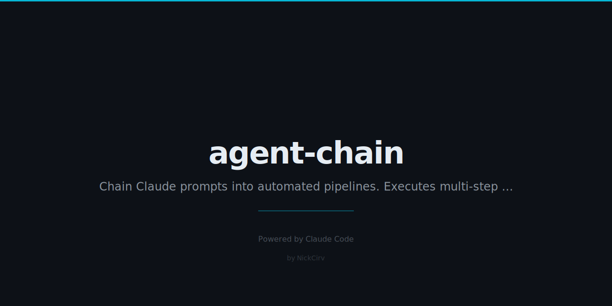

# agent-chain 🔗

Chain Claude AI prompts into pipelines.

```
[research] → [outline] → [write] → [seo]
```

One command. Sequential AI agents. Each step builds on the last.

---

## Install

```bash
npm install -g agent-chain
# or run directly
npx agent-chain run --chain blog.chain --input "AI in healthcare"
```

**Zero dependencies.** Uses only Node.js built-ins (`fs`, `path`, `https`).

---

## Quick Start

```bash
# Dry-run (no API key needed — shows prompts without calling API)
node index.js dry-run --chain examples/blog.chain --input "AI in healthcare"

# Full run (requires ANTHROPIC_API_KEY)
export ANTHROPIC_API_KEY=sk-ant-...
node index.js run --chain examples/blog.chain --input "AI in healthcare"
```

---

## Commands

| Command | Description |
|---------|-------------|
| `agent-chain run --chain FILE --input TEXT` | Execute a pipeline |
| `agent-chain run --chain FILE` | Run and prompt for input |
| `agent-chain dry-run --chain FILE --input TEXT` | Preview prompts without API calls |
| `agent-chain list` | List all `.chain` files in current directory |
| `agent-chain new NAME` | Scaffold a new chain file |

---

## Chain File Format

A `.chain` file is a simple text format — no YAML library required.

```
name: Blog Post Pipeline
model: claude-haiku-4-5-20251001
input: {{TOPIC}}

[research]
prompt: Research {{TOPIC}} and provide 5 key facts, statistics, and unique angles. Be concise.
max_tokens: 500

[outline]
prompt: Create a blog post outline based on this research: {{previous}}. Include intro, 3 main sections, conclusion.
max_tokens: 300

[write]
prompt: Write a full blog post from this outline: {{previous}}. 800 words, conversational tone.
max_tokens: 1200

[seo]
prompt: Improve this for SEO. Add meta description, improve headers, add keyword suggestions: {{previous}}
max_tokens: 600
```

### Substitutions

| Placeholder | What it becomes |
|-------------|----------------|
| `{{previous}}` | Output of the immediately preceding step |
| `{{STEP_NAME}}` | Output of any named step (e.g. `{{research}}`) |
| `{{INPUT}}` | The user's initial input text |
| `{{TOPIC}}` | Any custom placeholder defined in `input:` header |

---

## Example Chains

### Blog Post Pipeline (`examples/blog.chain`)

```
[research] → [outline] → [write] → [seo]
```

Turn a topic into a fully SEO-optimised blog post in one command.

```bash
node index.js run --chain examples/blog.chain --input "The future of remote work"
```

---

### Code Review Pipeline (`examples/code-review.chain`)

```
[analyze] → [security-check] → [suggest-improvements]
```

Multi-perspective code review: architecture analysis, security audit, then prioritised improvements.

```bash
node index.js run --chain examples/code-review.chain --input "$(cat my-script.js)"
```

---

### Product Launch Pipeline (`examples/product-launch.chain`)

```
[research-market] → [write-copy] → [write-emails]
```

Market research → landing page copy → 3-email launch sequence. All from one product description.

```bash
node index.js run --chain examples/product-launch.chain --input "A Notion template for solopreneurs"
```

---

## Output Format

Results are saved to `./chain-output/<pipeline-name>-<timestamp>/`:

```
chain-output/
  blog-post-pipeline-2025-01-15T10-30-00/
    research.txt
    outline.txt
    write.txt
    seo.txt
    _combined.txt          ← all steps merged
```

---

## API Setup

```bash
export ANTHROPIC_API_KEY=sk-ant-api03-...
```

**No API key?** `agent-chain` automatically switches to **dry-run mode** — it shows you exactly what prompts would be sent, with all substitutions resolved.

### Models

Any Anthropic model works. Set in your `.chain` file:

```
model: claude-haiku-4-5-20251001      # fast, cheap (default)
model: claude-sonnet-4-5              # smarter
model: claude-opus-4-5                # most capable
```

---

## Cost Estimates

After each run, `agent-chain` shows token usage and estimated cost:

```
Token usage:
  Input tokens:  1,847
  Output tokens: 2,341
  Est. cost:     $0.003398
```

Haiku (~$0.25/1M input, ~$1.25/1M output) makes multi-step pipelines extremely affordable.

---

## Scaffold a New Chain

```bash
node index.js new my-pipeline
# creates my-pipeline.chain with a 3-step template
```

---

## License

MIT
